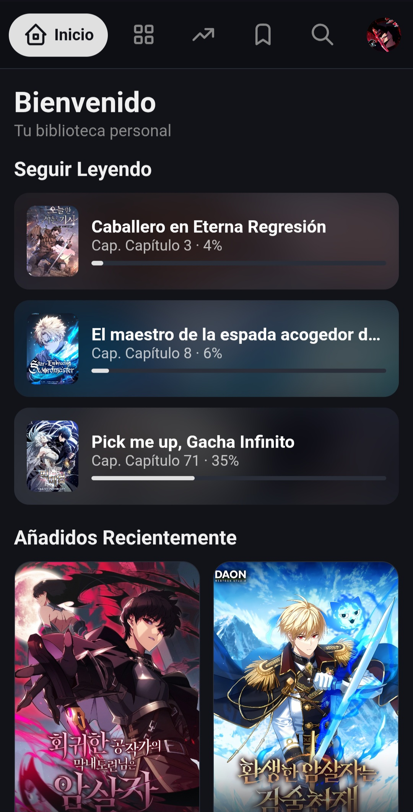
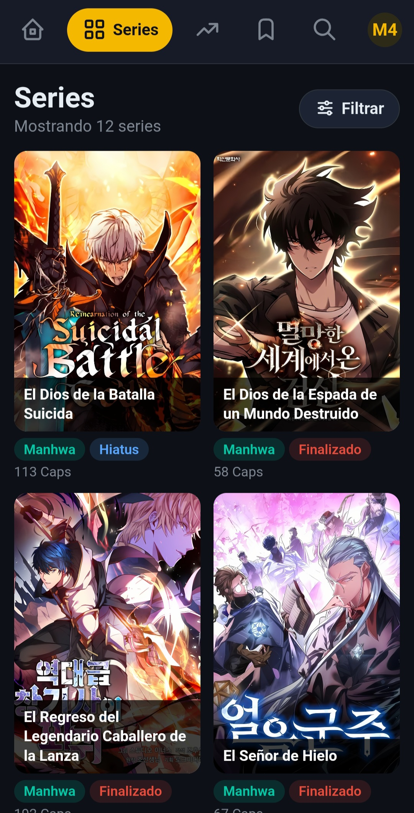
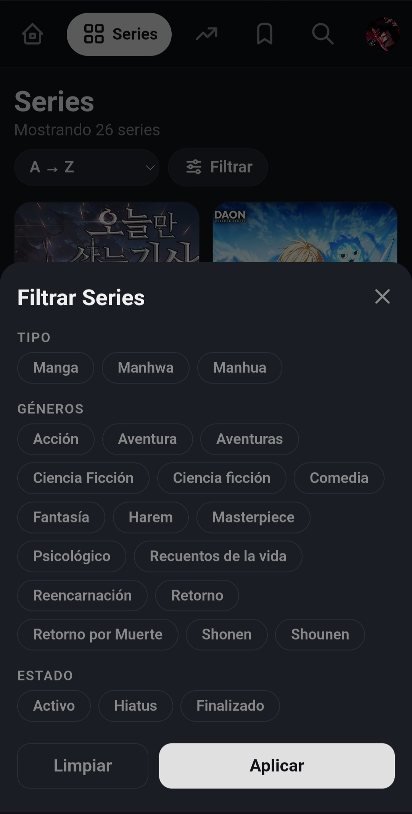
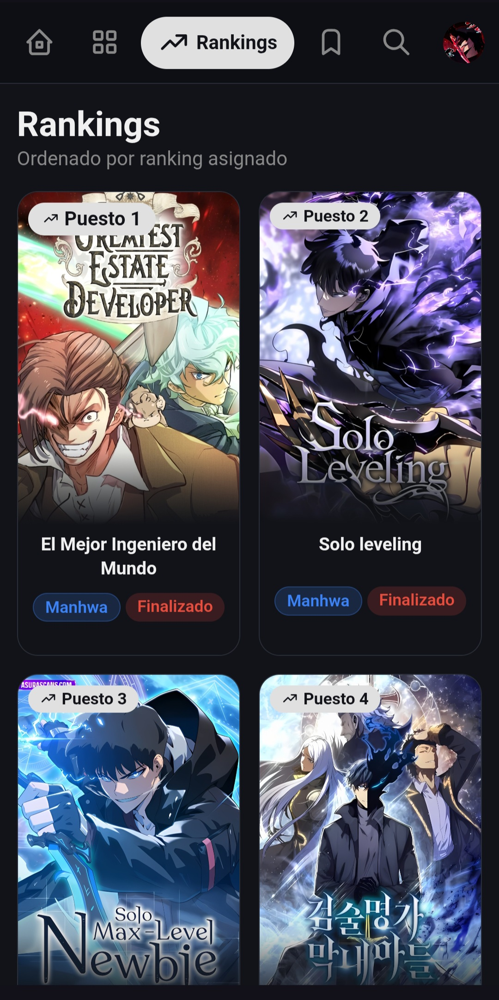
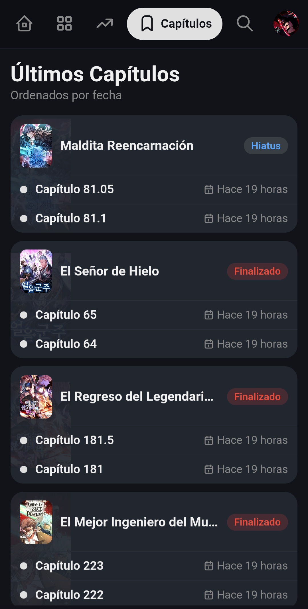
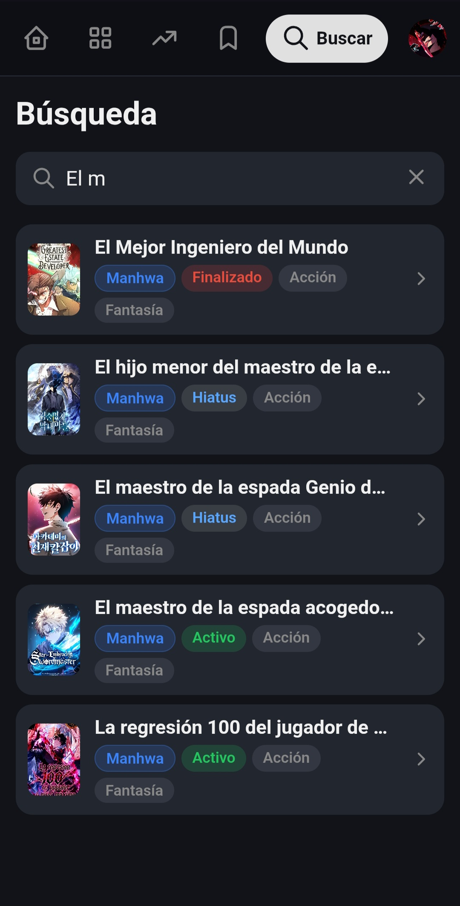
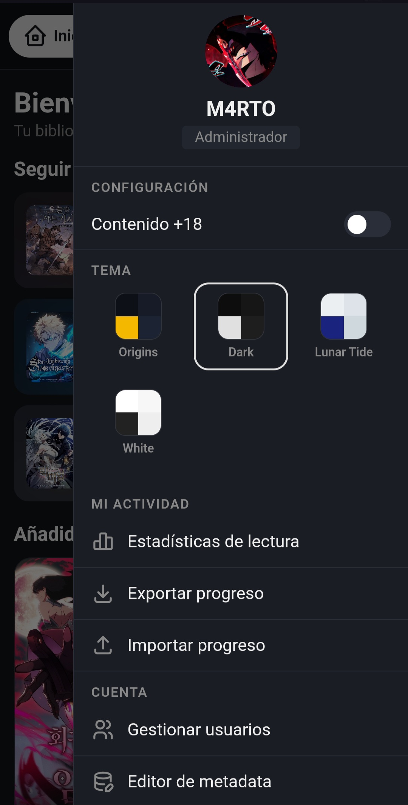

# M4RTO Server — Servidor Personal de Manga

Servidor personal para leer tu biblioteca de manga, manhwa y manhua desde cualquier dispositivo en tu red local. Funciona desde el navegador del celular, tablet o PC sin instalar nada en los dispositivos lectores.

---

## Índice

1. [Requisitos](#requisitos)
2. [Instalación](#instalación)
3. [Configuración](#configuración)
4. [Estructura de carpetas de mangas](#estructura-de-carpetas-de-mangas)
5. [Cómo usar el servidor](#cómo-usar-el-servidor)
   - [Inicio](#inicio)
   - [Series](#series)
   - [Rankings](#rankings)
   - [Últimos Capítulos](#últimos-capítulos)
   - [Búsqueda](#búsqueda)
   - [Panel de usuario](#panel-de-usuario)
6. [Acceso desde otros dispositivos](#acceso-desde-otros-dispositivos)
7. [Acceso remoto con Tailscale](#acceso-remoto-con-tailscale)
8. [Solución de problemas](#solución-de-problemas)
9. [Estructura del proyecto](#estructura-del-proyecto)

---

## Requisitos

Antes de instalar, asegúrate de tener lo siguiente en la PC que va a funcionar como servidor:

- **Node.js v18 o superior** — [descargar en nodejs.org](https://nodejs.org/)
- **Windows 10 / 11**
- Una carpeta con tus mangas organizados (ver [estructura de carpetas](#estructura-de-carpetas-de-mangas))
- Para acceso desde otros dispositivos: todos deben estar en la **misma red WiFi**

---

## Instalación

1. Descarga o clona el repositorio en tu PC
2. Copia el archivo `.env.example` y renómbralo a `.env`
3. Completa los valores del `.env` (ver [Configuración](#configuración))
4. Doble clic en **`iniciar_servidor.bat`** — ejecutar como **Administrador** la primera vez para que configure el firewall automáticamente
5. Abre el navegador en `http://localhost:3000`

> **Primera vez:** El `.bat` instala las dependencias automáticamente con `npm install`. Puede tardar un minuto.

---

## Configuración

Edita el archivo `.env` en la raíz del proyecto:

```env
# Nombre de usuario administrador
USERNAME=M4RTO

# Contraseña para entrar al servidor
PASSWORD=tu_contrasena_aqui

# Clave secreta para los tokens de sesión (texto largo y aleatorio)
JWT_SECRET=cambia_esto_por_algo_muy_largo_y_aleatorio_1234567890

# Puerto del servidor (por defecto 3000)
PORT=3000

# Ruta a tu carpeta de mangas principal
MANGA_PATH=D:\Mis Mangas

# Segunda carpeta de mangas (opcional)
MANGA_PATH_2=D:\Mis Mangas 2
```

> **Importante:** El archivo `.env` contiene tu contraseña. Nunca lo subas a GitHub. Ya está incluido en `.gitignore`.

---

## Estructura de carpetas de mangas

El servidor espera que cada manga esté en su propia carpeta, con los capítulos como subcarpetas que contienen las imágenes:

```
📁 Mis Mangas/
├── 📁 Solo Leveling/
│   ├── 📄 cover.jpg          ← portada (opcional)
│   ├── 📄 metadata.json      ← metadata (opcional)
│   ├── 📁 Capitulo_1/
│   │   ├── 001.jpg
│   │   ├── 002.jpg
│   │   └── ...
│   ├── 📁 Capitulo_2/
│   └── ...
└── 📁 Otro Manga/
    └── ...
```

**`cover.jpg`** — Portada del manga. Si no existe, el servidor usa la primera imagen del primer capítulo automáticamente.

**`metadata.json`** — Información del manga. Si no existe, aparece con valores por defecto. Ejemplo:

```json
{
  "type": "Manhwa",
  "status": "Activo",
  "genres": ["Acción", "Aventura", "Sistema"],
  "synopsis": "Sinopsis del manga...",
  "ranking": 1,
  "adult": false
}
```

| Campo | Valores posibles |
|---|---|
| `type` | `"Manga"`, `"Manhwa"`, `"Manhua"` |
| `status` | `"Activo"`, `"Hiatus"`, `"Finalizado"` |
| `genres` | Array de strings |
| `synopsis` | Texto libre |
| `ranking` | Número entero (1 = primero) o `null` |
| `adult` | `true` o `false` |

---

## Cómo usar el servidor

### Inicio



La pantalla principal muestra dos secciones:

**Seguir Leyendo** — Mangas que empezaste pero no terminaste, con barra de progreso y el último capítulo leído. Toca una tarjeta para ir directamente al detalle del manga.

**Añadidos Recientemente** — Los 10 mangas más nuevos de tu biblioteca, ordenados por fecha de creación de la carpeta.

---

### Series



Vista completa de tu biblioteca. Cada manga se muestra como una card con portada, nombre, tipo, estado y número de capítulos.

**Ordenar** — El selector permite ordenar por A→Z, Z→A, más nuevos o más capítulos.

**Filtrar** — Toca el botón "Filtrar" para abrir el panel de filtros.



El panel de filtros permite combinar múltiples criterios:

- **Tipo** — Manga, Manhwa o Manhua
- **Géneros** — Solo muestra los géneros presentes en tu biblioteca. Si el contenido +18 está desactivado, los géneros adultos no aparecen aquí
- **Estado** — Activo, Hiatus o Finalizado

El número en el botón "Filtrar" indica cuántos filtros están activos. El botón "Limpiar" los borra todos.

---

### Rankings



Muestra los mangas ordenados por el campo `ranking` del `metadata.json`. Los que no tienen ranking asignado aparecen al final.

Cada card muestra la portada, el número de puesto y los badges de tipo y estado. El ranking se asigna editando el `metadata.json` de cada manga o usando el Editor de metadata desde el panel de usuario.

---

### Últimos Capítulos



Lista los mangas ordenados por la fecha del capítulo más reciente, mostrando los 2 últimos capítulos de cada uno:

- **Punto amarillo** — capítulo no leído
- **Punto gris** — capítulo ya leído
- La fecha es relativa: "Hace 2 horas", "Hace 3 días", etc.

Toca el nombre del manga para ir a su detalle. Toca un capítulo para leerlo directamente. La lista está paginada de 20 en 20.

---

### Búsqueda



Busca mangas por nombre en tiempo real mientras escribes. Muestra portada, nombre, tipo, estado y géneros de cada resultado.

La búsqueda normaliza acentos y mayúsculas — buscar `"accion"` encuentra mangas con el género `"Acción"`.

---

### Panel de usuario



Accesible tocando el avatar en la esquina superior derecha. Desde aquí puedes:

**Configuración:**
- **Contenido +18** — Activa o desactiva la visibilidad de mangas marcados como adultos. Cuando está desactivado, esos mangas desaparecen de todas las secciones incluyendo búsqueda, filtros y rankings

**Temas visuales:**
- **Origins** — Fondo oscuro azulado con acento amarillo
- **Dark** — Fondo negro puro con acento gris claro
- **Lunar Tide** — Fondo azul claro
- **White** — Fondo blanco

**Mi actividad:**
- **Estadísticas de lectura** — Resumen de tu progreso: total de capítulos leídos, mangas completados, en progreso y no iniciados, distribución por tipo y estado
- **Exportar progreso** — Descarga un archivo `.json` con todo tu historial de lectura como backup
- **Importar progreso** — Restaura el progreso desde un archivo `.json` exportado anteriormente. Dos modos: *Reemplazar* (borra el actual) o *Combinar* (une ambos sin perder datos)

**Cuenta:**
- **Gestionar usuarios** *(solo admin)* — Crear, editar y eliminar usuarios del servidor
- **Editor de metadata** *(solo admin)* — Editar tipo, estado, ranking, géneros, sinopsis y flag +18 de cada manga directamente desde el navegador, sin tocar archivos manualmente
- **Cerrar sesión**

---

## Acceso desde otros dispositivos

Para acceder desde el celular u otro PC en la misma red WiFi:

1. El servidor muestra la IP local al arrancar — busca la línea `📱 Red local:`
2. Escribe esa URL en el celular: `http://192.168.x.x:3000`
3. El celular y la PC deben estar en el **mismo router/WiFi**

Si necesitas encontrar la IP manualmente, abre `cmd` y ejecuta:
```
ipconfig
```
Busca la sección "Adaptador de Wi-Fi" → **Dirección IPv4**.

---

## Acceso remoto con Tailscale

Para leer desde fuera de tu casa (datos móviles, otra red WiFi) sin exponer el servidor a internet, puedes usar **Tailscale** — una VPN gratuita que conecta tus dispositivos como si estuvieran en la misma red local.

**Configuración:**

1. Instala Tailscale en la PC del servidor: [tailscale.com/download](https://tailscale.com/download)
2. Instala Tailscale en el celular (disponible en App Store y Play Store)
3. Inicia sesión con la misma cuenta en ambos dispositivos
4. En Tailscale, cada dispositivo recibe una IP fija del rango `100.x.x.x`
5. Usa la IP de Tailscale de tu PC para acceder al servidor: `http://100.x.x.x:3000`

**Ventajas:**
- No necesitas abrir puertos en el router
- El tráfico va cifrado
- La IP de Tailscale no cambia aunque te muevas de red

**Notas:**
- La PC del servidor debe tener Tailscale activo y estar encendida
- Si la página carga pero no muestra las imágenes, asegúrate de que el servidor esté escuchando en `0.0.0.0` (ya está configurado así por defecto)
- Tailscale puede convivir con el acceso por red local sin problema

---

## Solución de problemas

### El servidor no arranca

**`Node.js no está instalado`**

Instala Node.js v18 o superior desde [nodejs.org](https://nodejs.org/) y reinicia la PC.

---

**`Error: listen EADDRINUSE :::3000`** — Puerto en uso

Hay otro proceso usando el puerto 3000. Ciérralo o cambia el `PORT` en el `.env`:

```powershell
# Ver qué proceso usa el puerto
netstat -ano | findstr :3000
# Matar el proceso (reemplaza <PID> por el número que apareció)
taskkill /f /pid <PID>
```

---

**`No se encontraron carpetas de mangas`**

El `MANGA_PATH` del `.env` no existe o está mal escrito. Verifica:
- Que la ruta exista en tu disco
- Que no tenga comillas: `MANGA_PATH=D:\Mis Mangas` ✅ — `MANGA_PATH="D:\Mis Mangas"` ❌
- Que la carpeta no esté vacía

---

### No conecta desde el celular

**1 — Verificar que el servidor esté corriendo**

Abre `http://localhost:3000` en la PC. Si no carga, el servidor no está iniciado.

**2 — Verificar que estén en la misma red**

El celular y la PC deben estar conectados al mismo router.

**3 — Abrir el puerto en el Firewall de Windows**

Abre PowerShell como **Administrador** y ejecuta:

```powershell
netsh advfirewall firewall add rule name="MangaServer Puerto 3000" dir=in action=allow protocol=TCP localport=3000 profile=private,domain
```

**4 — Cambiar la red de Pública a Privada**

`Win + I` → Red e Internet → WiFi → clic en tu red → **Perfil de red: Privado**

O por PowerShell:
```powershell
Set-NetConnectionProfile -InterfaceAlias "Wi-Fi" -NetworkCategory Private
```

**5 — Verificar conectividad**

```powershell
# Reemplaza con la IP de tu PC
Test-NetConnection -ComputerName 192.168.1.x -Port 3000
```

Si `TcpTestSucceeded` es `True`, el servidor es accesible. Si el celular aún no conecta, el router puede tener **Client Isolation** activado — desactívalo en la configuración del router.

---

### Los mangas no aparecen

- Verifica que las carpetas de mangas sean directorios (no archivos ZIP sin descomprimir)
- Verifica que dentro de cada manga haya al menos una subcarpeta de capítulo con imágenes
- Los formatos de imagen válidos son: `.jpg`, `.jpeg`, `.png`, `.webp`, `.gif`
- Reinicia el servidor después de agregar mangas nuevos

---

### Las imágenes no cargan

- Cierra sesión y vuelve a entrar para renovar el token
- Evita caracteres especiales como `#`, `?` o `%` en los nombres de carpetas

---

### El progreso no se guarda

El progreso se guarda en `server/progress.json`. Verifica que la carpeta `server/` tenga permisos de escritura.

---

## Estructura del proyecto

```
Servidor-de-Mangas/
├── client/                    ← Frontend
│   ├── index.html             ← Aplicación principal
│   ├── reader.html            ← Lector de capítulos
│   ├── login.html             ← Pantalla de login
│   ├── stats.html             ← Estadísticas de lectura
│   ├── css/app.css            ← Estilos (mobile-first, 4 temas)
│   ├── js/
│   │   ├── api.js             ← Cliente HTTP con caché
│   │   ├── app.js             ← Estado global, renders, navegación
│   │   ├── ui.js              ← Componentes visuales y cards
│   │   └── detail.js          ← Vista de detalle de manga
│   └── admin/
│       ├── users.html         ← Gestión de usuarios
│       └── metadata.html      ← Editor de metadata
├── server/                    ← Backend (Node.js + Express)
│   ├── index.js               ← Entrada del servidor
│   ├── middleware/auth.js     ← Verificación JWT
│   ├── routes/
│   │   ├── auth.js            ← Login, usuarios, avatares
│   │   └── manga.js           ← Biblioteca, capítulos, progreso
│   ├── data/users.json        ← Usuarios registrados
│   └── progress.json          ← Progreso de lectura por usuario
├── docs/screenshots/          ← Capturas de pantalla
├── .env                       ← Configuración local (NO subir a Git)
├── .env.example               ← Plantilla de configuración
├── metadata.example.json      ← Ejemplo de metadata.json
├── iniciar_servidor.bat       ← Lanzador Windows
└── package.json
```

---

## Notas de seguridad

- Diseñado para **red local privada**, no para exposición directa a internet
- El archivo `.env` está en `.gitignore` — nunca lo subas al repositorio
- Los tokens JWT expiran en 30 días
- Protección contra fuerza bruta en el login: bloquea una IP por 5 minutos tras 10 intentos fallidos
- Las imágenes requieren sesión activa para ser accesibles

---

*Desarrollado por M4RT05*
